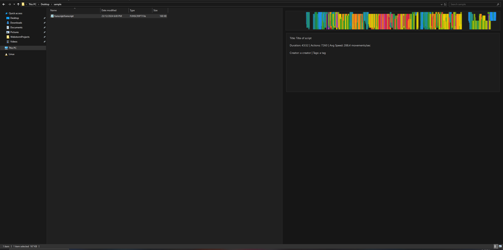

# Funscript Preview Handler for Windows

A Windows Explorer preview handler that allows you to preview .funscript files directly in the Windows Explorer preview pane.

## Features

- Visualizes funscript actions as a heatmap
- Displays metadata such as duration, action count, and average speed
- Shows creator information and tags when available
- Seamlessly integrates with Windows Explorer

## Installation

### Using the Installer

1. Download the latest installer from the [Releases](https://github.com/martinAlt335/FunscriptWindowsPreviewExtension/releases) page
2. Run the installer and follow the prompts
3. The preview handler will be automatically registered with Windows

## Updating

Run the newest installer. It will automatically handle uninstalling the previous version.

## Building from Source

### Prerequisites

- Visual Studio 2019 or newer
- .NET Framework 4.7.2 or newer

### Build Steps

1. Clone the repository
2. Open the solution in Visual Studio
3. Restore NuGet packages
4. Build the solution

## License

This project is licensed under the MIT License - see the [LICENSE](./LICENSE.md) file for details.

## Acknowledgments

- [SharpShell](https://github.com/dwmkerr/sharpshell) for the preview handler framework